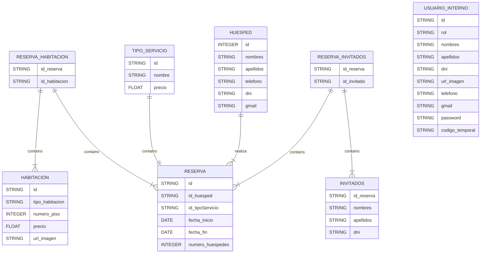

# DB model

```mermaid

erDiagram

    RESERVA {
        STRING id
        STRING id_huesped
        STRING id_tipoServicio
        DATE fecha_inicio
        DATE fecha_fin
        INTEGER numero_huespedes
    }

    TIPO_SERVICIO {
        STRING id
        STRING nombre
        FLOAT precio
    }

    RESERVA_HABITACION {
        STRING id_reserva
        STRING id_habitacion
    }

    HABITACION {
        STRING id
        STRING tipo_habitacion
        INTEGER numero_piso
        FLOAT precio
        STRING url_imagen
    }

    HUESPED {
        INTEGER id
        STRING nombres
        STRING apellidos
        STRING telefono
        STRING dni
        STRING gmail
    }

    INVITADOS {
        STRING id_reserva
        STRING nombres
        STRING apellidos
        STRING dni
    }

    RESERVA_INVITADOS {
        STRING id_reserva
        STRING id_invitado
    }

    USUARIO_INTERNO {
        STRING id
        STRING rol
        STRING nombres
        STRING apellidos
        STRING dni
        STRING url_imagen
        STRING telefono
        STRING gmail
        STRING password
        STRING codigo_temporal
    }

    RESERVA_HABITACION ||--|{ RESERVA : contains
    TIPO_SERVICIO ||--|| RESERVA : contains
    RESERVA_HABITACION ||--|{ HABITACION : contains
    HUESPED ||--|{ RESERVA : realiza
    RESERVA_INVITADOS ||--|{ INVITADOS : contains
    RESERVA_INVITADOS ||--|{ RESERVA : contains

```
