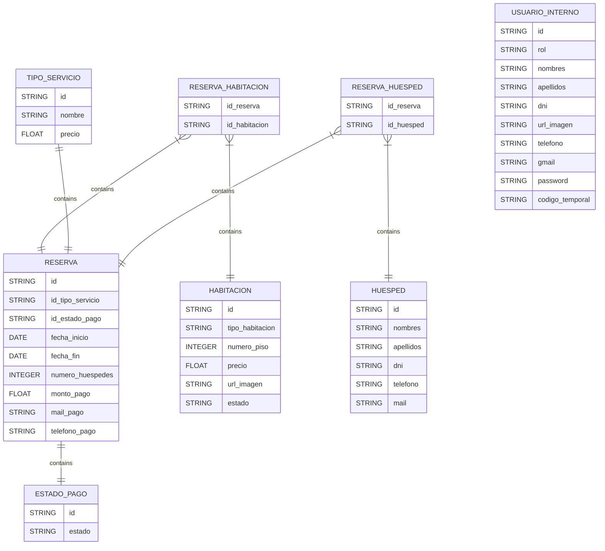

# DB model

```mermaid

erDiagram

    RESERVA {
        STRING id
        STRING id_tipo_servicio
        STRING id_estado_pago
        DATE fecha_inicio
        DATE fecha_fin
        INTEGER numero_huespedes
        FLOAT monto_pago
        STRING mail_pago
        STRING telefono_pago
    }

    TIPO_SERVICIO {
        STRING id
        STRING nombre
        FLOAT precio
    }

    RESERVA_HABITACION {
        STRING id_reserva
        STRING id_habitacion
    }

    HABITACION {
        STRING id
        STRING tipo_habitacion
        INTEGER numero_piso
        FLOAT precio
        STRING url_imagen
        STRING estado
    }

    HUESPED {
        STRING id
        STRING nombres
        STRING apellidos
        STRING dni
        STRING telefono
        STRING mail
    }

    RESERVA_HUESPED {
        STRING id_reserva
        STRING id_huesped
    }

    USUARIO_INTERNO {
        STRING id
        STRING rol
        STRING nombres
        STRING apellidos
        STRING dni
        STRING url_imagen
        STRING telefono
        STRING gmail
        STRING password
        STRING codigo_temporal
    }

    ESTADO_PAGO {
        STRING id
        STRING estado
    }

    RESERVA_HABITACION }|--|| RESERVA : contains
    TIPO_SERVICIO ||--|| RESERVA : contains
    RESERVA_HABITACION }|--|| HABITACION : contains
    RESERVA_HUESPED }|--|| HUESPED : contains
    RESERVA_HUESPED }|--|| RESERVA : contains
    RESERVA ||--|| ESTADO_PAGO : contains

```
