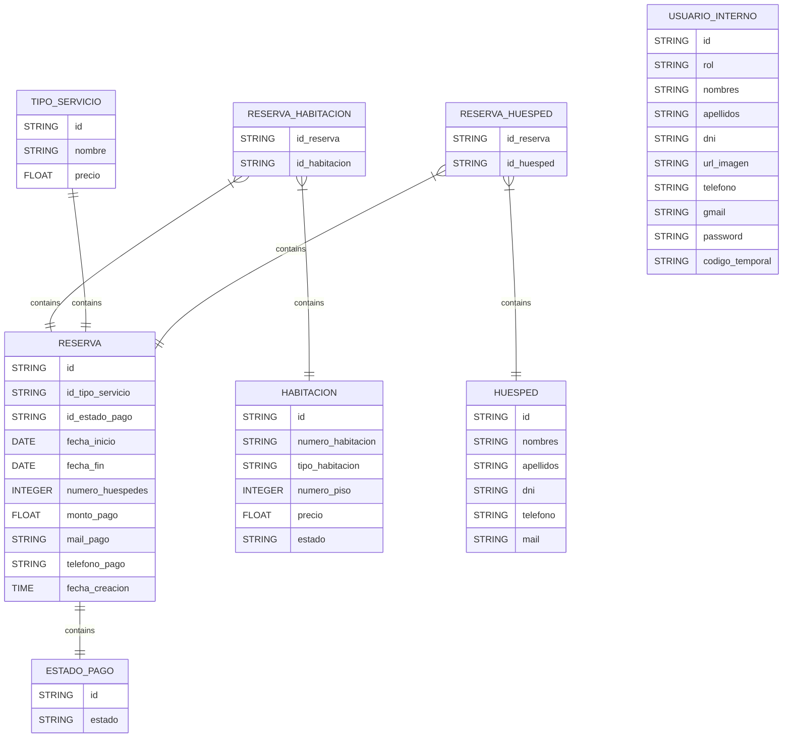
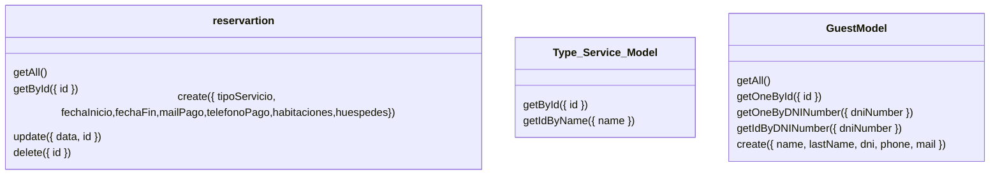

# DB model

- [ ] RESERVA
- [X] TIPO_SERVICIO
- [ ] RESERVA_HABITACION
- [X] HABITACION
- [ ] HUESPED
- [ ] RESERVA_HUESPED
- [ ] USUARIO_INTERNO
- [X] ESTADO_PAGO

## Class Diagram (Use case reservation)

